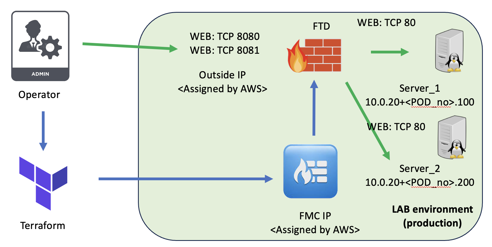
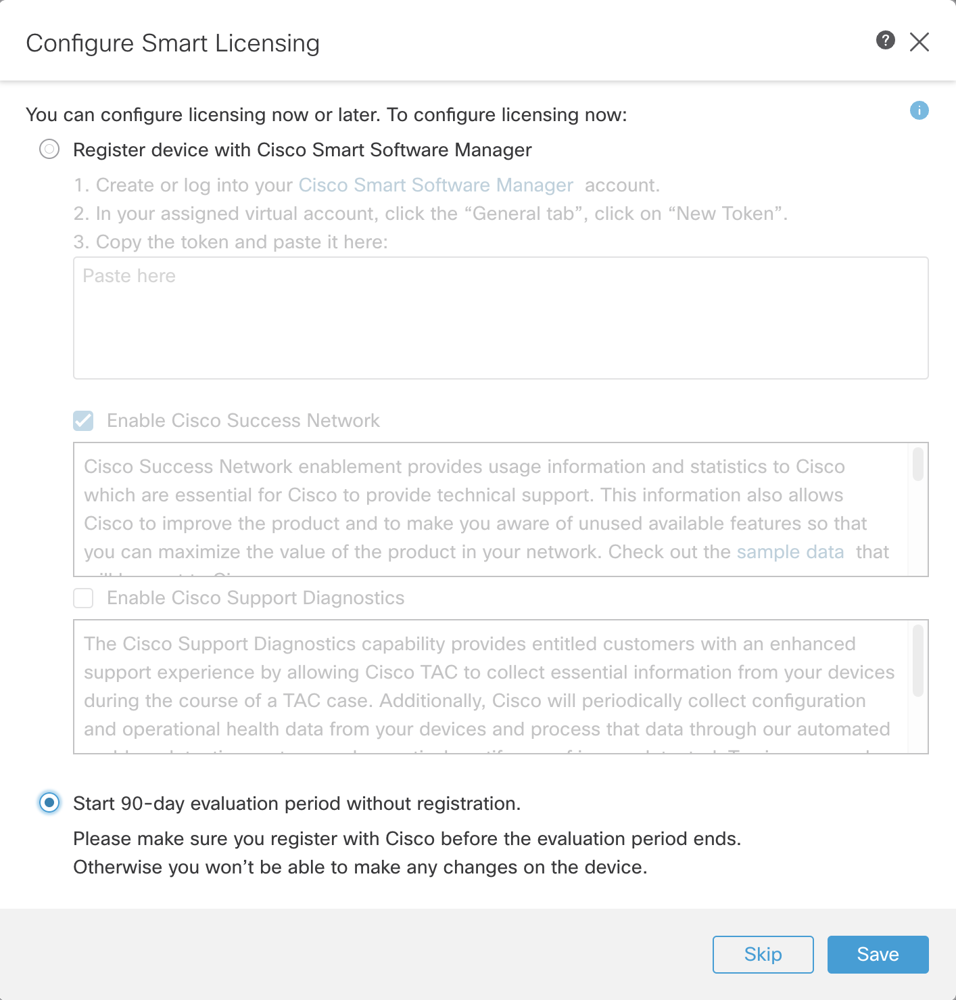
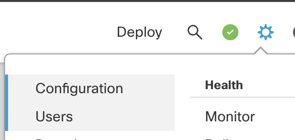
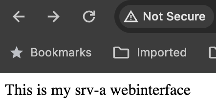

# Welcome to CiscoLive WIL LABSEC-2334 tutorial!

## Introduction

In this exercise, you are going to configure Cisco Secure Firewall via Terraform Provider.

> <em><strong>Note:</strong></em> The Cisco Secure Firewall infrastructure has been already deployed in a programmatic way in the AWS environment by Terraform AWS provider.


Cisco solution, in this scenario, consists of:
- Cisco Secure Firewall Management Center (FMC)
- Cisco Secure Firewall (formerly Firepower Threat Defense/FTD)

Other devices in use:
- Server 1 - running Apache2 on port 80
- Server 2 - running Apache2 on port 80
<br><br>

> <em><strong>Note:</strong></em> Here is the link to the initial repository from which CSF enviroment was provisioned: `https://github.com/mmaciejc/CiscoLive24_AWS_infra` 


## Goal of the Lab:

We are going to push the configuration that will create:
- hosts,
- ports
- physical interfaces,
- access policy
- NAT policy
- Policy assignement
- Deploy

As a result we should be able to access Linux server which is in Private subnet of AWS VPC.

## Network Diagram
Lab diagram


## Lab tasks:
To complete this lab, you would need to go through the following tasks:
1. Confirm the status of current enviroment and collect assigned IPs
2. Download the Terraform configurartion files from GitHub
3. Review and confirm configuration of Cisco Secure Firewall.
4. Deploy the desired configuration via Terraform.
5. Do the verification of the deployment and application.
6. Lab clean-up

#### Task 1:

Please SSH to Linux host and verify: 
- Credentials are provided in the POD description.
- Putty or any SSH client you prefer can be used.

#### Task 2:

In the user home directory `~/` there shold be folder named `CiscoLive24_AWS_infra`. In this folder there is a Terraform configuration for provisioned Secure Firewall virtual components.

```bash
~$ cd CiscoLive24_AWS_infra
~/CiscoLive24_AWS_infra$ terraform output

fmc_hostname = "<IP address>"
fmcv01_private_ip = "<IP address>"
ftd_inside_ip = "<IP address>"
ftd_mgmt_ip = toset([
  "<IP address>",
])
ftd_outside_ip = "<IP address>"
ftdv01_IP = "<IP address>"
server_1_ip = toset([
  "<IP address>",
])
server_2_ip = toset([
  "<IP address>",
])
```

You can verify current CSF deployment in AWS by:
```bash
% terraform plan 
... output ommited ...

No changes. Your infrastructure matches the configuration.

Terraform has compared your real infrastructure against your configuration and found no differences, so no changes are needed.
```
#### Task 3:
Login to FMC (Public IP of the FMC is in outputs from Task 2 lisetd as `fmc_hostname`):
- create initial password (please use `CiscoLive24!`), 
- select evaluation license valid for 90 days,

- create admin user: `apiadmin` with password: `CiscoLive24!`


* you will use these data in task #5

#### Task 4:

Please be careful to keep the different Terraform configurations in the separate folders.
```bash
% cd ../
$ pwd
/home/user_1
% git clone https://github.com/mmaciejc/CiscoLive24
% cd CiscoLive24
% ls
000-variables.tf		data_resources.tf		resource-interfaces.tf		resource-securityzones.tf
0000-fmc.tf			resource-accesspolicy.tf	resource-ipspolicy.tf		terraform.tfstate
0000-provider.tf		resource-devices.tf		resource-objects.tf		terraform.tfstate.backup
README.md			resource-ftdnatpolicy.tf	resource-policy_deployment.tf	terraform.tfvars

```

#### Task 5: Create Terraform input variables file:
Please create `terraform.tfvars` file, you might use `vim`, `nano` or ny other editor.

```bash
vim terraform.tfvars
```

```hcl
fmc_username = "apiadmin"
fmc_password = "<password>"
fmc_hostname = "<output from Task 2>"
ftd_mgmt_ip = "10.0.20.10"
server_1_ip = "10.0.20.100"
server_2_ip = "10.0.20.200"
```

#### Task 6: Review and confirm current configuration

```bash
% cat variables.tf 

###########################################
#### Define variables
###########################################

variable "fmc_password" {
  type        = string
  description = "FMC Password"
}

variable "fmc_username" {
  type = string
  description = "FMC username"
}

variable "fmc_hostname" {
  type = string
  description = "FMC hostname"
}

variable "ftd_mgmt_ip" {
  type = string
  description = "FTD Management Private IP address"
}

variable "server_1_ip" {
  type = string
  description = "Server 1 Private IP address"
}

variable "server_2_ip" {
  type = string
  description = "Server 2 Private IP address"
}
```

Full description of the resources used can be found [here:](docs)

#### Task 7: Execute Terraform

```bash
% terraform init
... output ommited ...
% terraform plan
... output ommited ...
% terraform apply
... output ommited ...
```

#### Task 8: Verify the deployment
- The FMC should deploy configuration to FTD
- You should be able to access Server_1 on port `8080`

